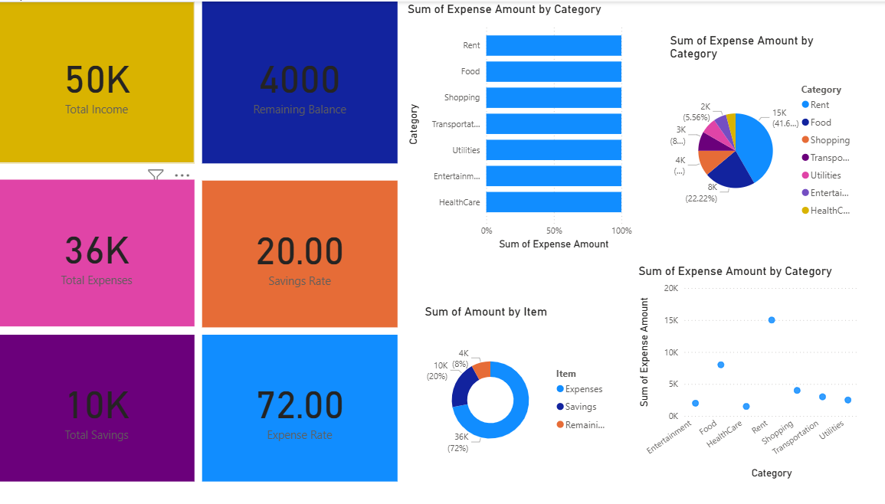

# Personal Expense Dashboard

## Project Overview
This Power BI dashboard helps analyze personal income and expenses. It provides insights into spending patterns, savings, and budget management through interactive visualizations.

## Tools Used
- Power BI
- Microsoft Excel
- GitHub

## Dashboard Features
- Total Income
- Total Expenses
- Remaining Balance
- Expense by Category
- Monthly Expense Trend
- Payment Mode Analysis
- Savings Overview

## Key Insights
- Food and Shopping account for the highest expenses.
- Monthly spending trends help identify peak expense periods.
- Digital payments are used more frequently than cash.
- Remaining balance indicates monthly savings.
- Category-wise analysis helps improve budgeting.

## Files Included
- PED.xlsx – Dataset
- dashboard4.pbix – Power BI Dashboard
- db4.png – Dashboard Screenshot

## Dashboard Preview

